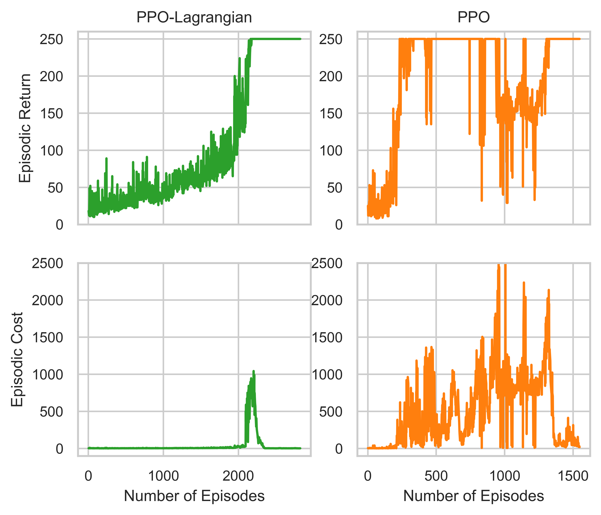

# PPO-Lagrangian
This repository provides PyTorch implementations for PPO \[[Schulman et al, 2017](https://arxiv.org/abs/1707.06347)\] and PPO-Lagrangian \[[Ray et al, 2019](https://arxiv.org/abs/2112.10593)\]. An adaptation of the gym Cart Pole environment with continuous action space is also implemented.

## Background


## Requirements
This repository has been tested on Ubuntu 22.04.
```
gymnasium=0.29.1
matplotlib=3.8.3
numpy=1.26.4
tensorboard=2.16.2
torch=2.2.0
tqdm=4.66.2
```

## Result
